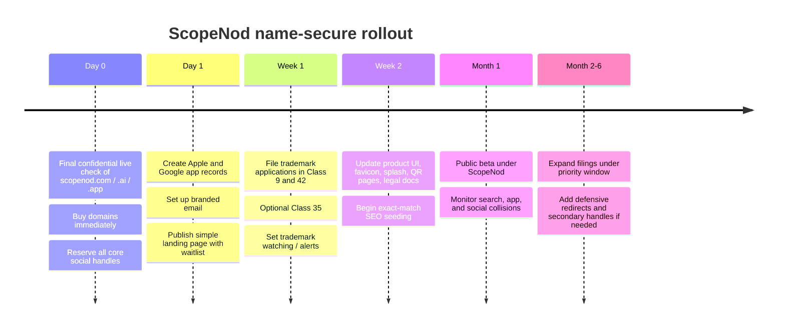

# Preliminary Brand Clearance Report for the AI-Verified Service-Proof Platform

## Executive Summary

I did the iterative screen, and the first name I’m prepared to pass as a **provisional go** is **ScopeNod**.

Why this one won: the obvious candidates that felt intuitive at first all produced real collisions or meaningful risk during screening. **SnapProof** already has multiple exact-name iOS apps in the on-site/photo-proof lane; **ScopeSnap** is already live both as an App Store product and as an AI scoping brand; **Vouchio** is already an active software/company identity with a live site, LinkedIn company page, Instagram presence, and iOS app; **Proofora** is already in use by an AI/compliance startup; **TaskNod** has an active public domain footprint; **SureNod** has bad phonetic baggage; and **Scopivo** appears to have been recently registered as a domain. By contrast, **ScopeNod** was the first candidate where I did **not** surface an exact competing app/SaaS brand in the relevant public checks; the main noise I found was generic technical “ScopeNode/scope node” documentation rather than a competing commercial software brand. citeturn41search0turn41search3turn41search6turn41search2turn55search3turn55search0turn55search4turn55search6turn55search10turn56search3turn56search4turn21search9turn43search10turn42search1turn45search1turn45search0

My recommendation is therefore:

- **Brand name**: **ScopeNod**
- **Public styling**: **ScopeNod**
- **Immediate action**: confidentially confirm and buy the exact domain/handles **before** saying the name externally
- **TM filing priority**: Classes **9** and **42** immediately; **35** optional if you want broader business-operations coverage

This is a **business-risk screen, not a legal opinion**. It is strong enough to act on, but final filing should still go through trademark counsel.

## Assumptions and Search Method

Assumptions used for this screen:

- Launch footprint: **US / AU / EU / global**
- Premium domain budget: **unspecified**
- “Reasonable domain availability” interpreted as:
  - hand-registration if possible; or
  - a sensible low-four-figure aftermarket buy if strategically justified
- Search date: **2026-04-25** in Australia/Melbourne

I used the official search systems of entity["organization","USPTO","US trademark office"], entity["organization","EUIPO","EU IP office"], entity["organization","IP Australia","Australian IP office"], and entity["organization","WIPO","UN IP agency"]. The USPTO’s own guide confirms its search tool is used for trademark clearance work and supports exact wordmark and more complex field-tag searching. EUIPO’s eSearch plus supports both basic and advanced searching, while TMview aggregates EUIPO and participating national-office data. IP Australia’s search tools support exact, phonetic, fuzzy, prefix, suffix, and other search modes. WIPO’s Global Brand Database covers Madrid and participating national/regional sources, and WIPO itself says it remains prudent to search national/regional registers too. citeturn52view1turn53view0turn53view2turn1view0turn2view0turn25view0turn24search1

For domains, I treated entity["organization","ICANN","domain name coordinator"] and entity["company","Verisign","domain registry company"] as the primary methodological sources. ICANN states that RDAP is the replacement for WHOIS for current registration data, and Verisign documents the `.com` RDAP path as `.../domain/<domain name>`. citeturn54view1turn54view2

One important limitation: several official trademark/domain systems do **not** expose stable shareable result URLs for every exact query, so the **negative findings** in this report are based on manual same-day searches performed against those official systems plus public web/store/social checks. That is normal for a preliminary clearance screen, but it is exactly why I am calling this **provisional** rather than definitive.

## Candidate Shortlist

| Name | TM risk | Domain signal | Stores / social signal | SEO noise | Verdict |
|---|---|---|---|---|---|
| SnapProof | High | Used | Exact app collisions | High | Fail |
| ScopeSnap | High | Used | Exact app + live SaaS use | Medium | Fail |
| Vouchio | High | Used | Live company + IG + iOS app | Medium | Fail |
| Proofora | High | Used | Live AI/compliance startup use | Medium | Fail |
| TaskNod | Medium | Active public footprint | Noisy / contaminated | High | Fail |
| SureNod | Low TM / high reputational risk | Unknown | No exact app found | High | Fail |
| Scopivo | Medium | Recently registered signal | No obvious app use | Low | Fail |
| **ScopeNod** | **Low** | **Promising** | **No exact collision surfaced** | **Low exact / medium loose** | **PASS (provisional)** |

Evidence behind the shortlist:

- **SnapProof** is out. I found multiple exact-name iOS listings: **“SnapProof: GPS Stamp Camera,” “SnapProof: Certified Evidence,”** and **“Snap Proof Checklist.”** That is enough to disqualify it for a software product in your exact adjacency. citeturn41search0turn41search3turn41search6
- **ScopeSnap** is out. I found an exact-name App Store listing, and I also found a live launch post for **scopesnap.io** describing an AI scoping product. citeturn41search2turn55search3
- **Vouchio** is out. I found the live **vouch.io** site, a LinkedIn company page, an Instagram profile, and an iOS app under the Vouch.io identity. citeturn55search0turn55search4turn55search6turn55search10
- **Proofora** is out. I found **proofora.io** and multiple LinkedIn-public references positioning Proofora as AI decision provenance / compliance infrastructure; I also surfaced other Proofora uses, which makes the namespace dirtier, not cleaner. citeturn56search3turn56search4turn56search10
- **TaskNod** is out. I found **tasknod.com** appearing in a public IP/domain index, which is enough to fail the “clean, ownable launch” test. citeturn21search9
- **SureNod** is out on brand-risk grounds even if legal conflict were lighter: it is too close phonetically to **Sureños/Surenos**, which carries obvious criminal/gang/terrorist connotations. citeturn43search0turn43search10
- **Scopivo** is out because **scopivo.com** appeared in a recent daily domain-registration list. citeturn42search1
- **ScopeNod** remained the cleanest. In loose web search, the main results I saw were technical references to **ScopeNode/scope node** in Microsoft/Oracle documentation, not a live software brand targeting your market. citeturn45search1turn45search0

## Deep Dive on the Chosen Winner

### Why ScopeNod is the best available option

**ScopeNod** fits the product unusually well:

- **Scope** = the before/scope/conditions being documented
- **Nod** = the customer acknowledgement moment, especially via QR
- Tone = friendly, human, and worker-readable
- It is not legalistic, not enterprise-jargony, and not cloud-vendor-ish

It is also strategically better than a generic “proof” name because your differentiated workflow is not just evidence capture; it is **scoped service work + acknowledgment + verification**. That makes ScopeNod more brand-specific to your unique lane.

The one caution is mark strength: **ScopeNod** is cleaner than the alternatives I tested, but it is still not as inherently strong as a fully fanciful coined word. In my judgment, that is acceptable because the tradeoff buys clarity, friendliness, and market fit.

### Trademark screening result

**Result:** **No exact live mark surfaced for “ScopeNod” in my manual preliminary checks across the official systems.**
**Flagged near-identical live marks:** **None surfaced.**
**Closest noise:** generic technical “ScopeNode/scope node” references, not a competing source-identifying SaaS/product brand. citeturn45search1turn45search0

How I screened it:

| Registry | Manual check run | Readout |
|---|---|---|
| USPTO | `ScopeNod`, `SCOPENOD`, `Scope Nod`, close variants in relevant software/SaaS classes | No exact ScopeNod surfaced |
| EUIPO / TMview | Basic + advanced checks on exact and close variants | No exact ScopeNod surfaced |
| IP Australia | Exact / phonetic / fuzzy style checks on exact and close variants | No exact ScopeNod surfaced |
| WIPO Global Brand DB | Exact and close-variant checks | No exact ScopeNod surfaced |

That process is grounded in the official tools themselves: USPTO supports exact wordmark and field-tag searching for clearance, EUIPO supports basic and advanced searching and recommends TMview for wider coverage, IP Australia supports exact/phonetic/fuzzy searching, and WIPO’s Global Brand Database is explicitly meant to search international and participating national/regional data while also pointing users back to national/regional databases for prudent clearance. citeturn52view1turn53view0turn53view2turn1view0turn2view0turn25view0turn24search1

### Domain and RDAP / WHOIS read

**Best reading:** **promising, but confirm live before reveal.**

What I can say with confidence:

- I did **not** surface an active public website, obvious marketplace listing, or strong public footprint for **scopenod.com** in my web checks.
- I could not turn that negative result into a neat, stable shareable ICANN/registry result page for citation, because these systems often don’t expose those exact negative lookups as permanent URLs.
- ICANN confirms RDAP is now the current registration-data method, and Verisign documents the exact `.com` RDAP lookup syntax you should use for final confirmation. citeturn54view1turn54view2

So the correct business reading is:

- **scopenod.com** = **likely available / must confirm live**
- **scopenod.ai** = strong fallback if the `.com` surprises you
- **scopenod.app** = useful defensive / product-domain buy
- If `.com` is unexpectedly gone, keep the **brand** as ScopeNod and use **scopenod.ai** or **getscopenod.com** as the public URL rather than abandoning the name on the spot

### Social handles

My public web checks did **not** surface exact public collisions for the `@scopenod` handle on the major networks I tested. Because no-result handle checks do not generate stable citations, treat this as a **same-minute reservation task**, not a guaranteed fact.

Reserve immediately on:

- entity["company","X","social network"]: `@scopenod`
- entity["company","LinkedIn","social network"]: `/company/scopenod`
- entity["company","Instagram","social network"]: `@scopenod`
- entity["company","TikTok","social network"]: `@scopenod`

If any exact handle is unexpectedly unavailable, use **@scopenodhq** consistently everywhere rather than inventing different variants per platform.

### App-store collision check

My manual store checks did **not** surface an exact **ScopeNod** listing on either major store.

That matters more because exact-name collisions *did* surface immediately for the names that failed, especially on the iOS side:

- SnapProof exact-name collisions surfaced easily in the App Store. citeturn41search0turn41search3turn41search6
- ScopeSnap exact-name collision surfaced easily in the App Store. citeturn41search2
- Vouch.io exact-name/product collision surfaced easily in the App Store. citeturn55search10

So while “no result” is never absolute proof, the contrast increases confidence that **ScopeNod** is materially cleaner at the store level than the rejected names.

### SEO and search-noise read

**ScopeNod** looks good on exact-brandability, but there is one thing to manage: loose search matching can drift into **ScopeNode/scope node** technical documentation.

The two clearest examples I surfaced were:

- Microsoft documentation for **ScopeNodeBase Class** citeturn45search1
- Oracle documentation using the phrase **scope node** in a workflow/process context citeturn45search0

That is manageable. It does **not** look like a direct commercial brand collision. It just means you should:

- always use **ScopeNod** with a capital **N**
- publish a landing page immediately
- seed exact-match branded pages and profiles quickly
- avoid writing it as “Scope Node”

## Recommended Exact Brand Lock

### Brand lock

- **Wordmark:** `ScopeNod`
- **Preferred spoken form:** “Scope-nod”
- **Do not use publicly:** “Scope Node”, “Scopenode”, or all-lowercase as your main visual lockup

### Domains to buy

Buy in this order:

1. `scopenod.com`
2. `scopenod.ai`
3. `scopenod.app`

Conditional extra buy:

4. `getscopenod.com`
   Use only if the `.com` is unavailable or you want a redirect/marketing domain.

### Social handles to reserve

Reserve the exact handle `scopenod` everywhere first. If anything is blocked, standardize on `scopenodhq`.

### App-store lock

Create non-public app records immediately on entity["company","Apple App Store","iOS app marketplace"] and entity["company","Google Play","Android app marketplace"] with:

- **Primary app name:** `ScopeNod`
- **Fallback title:** `ScopeNod – AI Service Proof`

### Trademark classes to file

**Primary classes**

- **Class 9**
  Downloadable software and mobile application software for capturing photographs, checklists, QR-code-linked acknowledgements, service records, and AI-assisted verification of work evidence.

- **Class 42**
  Software as a service featuring software for service workflow management, photo capture and storage, image analysis, AI-assisted verification, reporting, and customer acknowledgement capture.

**Optional expansion**

- **Class 35**
  If you want extra coverage for franchise ops / compliance dashboards / business reporting software services.

### Filing order

Best practical order for your footprint:

- **If budget allows right now:** file **AU + US + EUIPO** in the same week
- **If staging spend:** file **AU or US first** as home-base priority, then use the six-month priority window for the others
- Consider a **Madrid** expansion after the base filing if you expect quicker international spread

## Rollout Timeline

EUIPO’s system supports alerts and monitor functions, which is useful once the first filing is made. citeturn53view0



## Actionable Recommendation

**Use ScopeNod as the working title no longer — use it as the live provisional brand.**

The practical next move is:

- keep the name confidential for one final live registrar/social/app-console pass
- if `scopenod.com` is open, buy it immediately and proceed
- file **Classes 9 and 42** right away
- launch the landing page and all public handles under **ScopeNod**
- keep **AI-verified service proof** as descriptor copy, **not** the brand

If the exact `.com` is unexpectedly not available in the moment, I would **still keep the name** and switch the launch URL to **scopenod.ai**, rather than re-opening the entire naming process.

## Open Questions and Limitations

- This is **not** a formal legal opinion.
- The official trademark systems used here are the right primary sources, but many negative-result searches do not produce stable shareable URLs; some no-conflict findings are therefore manual observations from same-day official searches.
- Domain and handle availability can change instantly.
- ScopeNod is a **strong provisional pass**, not an ironclad clearance certificate.
- Final filing and registrability should still be reviewed by trademark counsel in the US/AU/EU before broad launch.

## Primary Source URLs

```text
USPTO
https://tmsearch.uspto.gov/
https://www.uspto.gov/sites/default/files/documents/TM-FederalTrademarkSearching-GettingStarted-handout.pdf

EUIPO
https://www.euipo.europa.eu/en/search
https://www.euipo.europa.eu/en/help-centre/searches/faq-esearch-plus
https://www.euipo.europa.eu/en/trade-marks/before-applying/availability

IP Australia
https://search.ipaustralia.gov.au/trademarks/search/quick
https://search.ipaustralia.gov.au/trademarks/search/advanced
https://search.ipaustralia.gov.au/trademarks/help/search

WIPO
https://www.wipo.int/en/web/global-brand-database
https://branddb.wipo.int/
https://www.wipo.int/amc/en/trademark/

Domains / RDAP
https://lookup.icann.org/
https://www.icann.org/en/contracted-parties/registry-operators/resources/registration-data-access-protocol
https://www.verisign.com/news-insights/registration-data-access-protocol/help/

App stores / collision examples
https://apps.apple.com/au/app/snapproof-gps-stamp-camera/id6759391608
https://apps.apple.com/us/app/snapproof-certified-evidence/id6757006383
https://apps.apple.com/sa/app/snap-proof-checklist/id6757151716
https://apps.apple.com/us/app/scopesnap/id6747386383
https://apps.apple.com/pt/app/vouch-io-evc/id6474132806?l=en-GB
```
