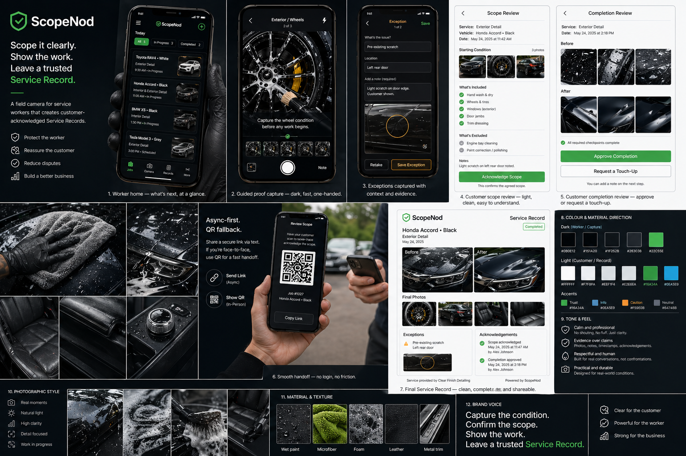

# ScopeNod PRD Final

**Product:** ScopeNod
**Status:** Final PRD - build-ready V1 brief
**Date:** 2026-04-25
**Primary wedge:** Mobile car detailing
**Hero metaphor:** A field camera that creates a Service Record
**Default platform:** Mobile web
**Core promise:** Capture the condition. Confirm the scope. Show the work. Leave a trusted Service Record.

## 1. One-Sentence Pitch

ScopeNod is a mobile field camera for service workers that turns before, during, and after photos into a customer-acknowledged Service Record.

## 2. Product Thesis

Mobile service work breaks down at predictable moments:

- the starting condition is not captured clearly
- the agreed scope lives in memory, texts, or loose conversation
- exceptions are noticed after the customer has already complained
- the worker has no polished way to show the work
- completion relies on trust instead of a shared record

ScopeNod solves this by giving the worker a fast, camera-led workflow that produces a clear visual record both worker and customer can understand.

Internally, ScopeNod is liability protection and service quality infrastructure. Externally, it should feel like a calm, premium field camera that produces a useful Service Record.

The product should not pretend acknowledgement, evidence, timestamps, and audit events are not compliance-adjacent. They are. The design challenge is to make that protection feel respectful, lightweight, and genuinely useful rather than bureaucratic.

## 3. What This Is And Is Not

### This Is

- A field camera for documenting service work.
- A customer scope and completion acknowledgement flow.
- A visual Service Record for workers, customers, and operators.
- A practical dispute-reduction tool.
- A quality consistency layer that does not feel punitive.

### This Is Not

- A legal contract platform.
- A waiver product.
- A scheduling or dispatch system.
- A payment or invoicing product.
- A full CRM.
- A worker surveillance dashboard.
- An AI quality-scoring product.

## 4. Brand Lock

### Name

The product brand is **ScopeNod**.

Use this exact styling everywhere:

- ScopeNod

Do not use:

- Scope Node
- Scopenode
- ScopeNOD
- all-lowercase as the main visual lockup

### Brand Meaning

ScopeNod combines the two core user moments:

- **Scope**: the condition, work boundary, inclusions, exclusions, and visible evidence.
- **Nod**: the customer acknowledgement moment, especially the lightweight nod of approval via link or QR.

The name should feel human, practical, and worker-readable. It should not sound legalistic or enterprise-heavy.

### Descriptor Copy

Use **AI-verified service proof** as descriptor copy, not as the brand.

Examples:

- ScopeNod - AI-verified service proof
- ScopeNod helps mobile service teams capture scope, proof, and customer acknowledgement.
- Service Record powered by ScopeNod

Avoid leading with AI in customer-facing copy. ScopeNod is a Service Record product with AI assistance in the background.

### Domain And Handle Assumptions

The brand clearance screen recommended confidentially securing:

- `scopenod.com`
- `scopenod.ai`
- `scopenod.app`
- `@scopenod` handles where available
- `@scopenodhq` as the consistent fallback

These are launch-readiness tasks, not product dependencies.

### Visual Reference

This PRD should be read alongside the moodboard image in the same directory:

- `scopenod_moodboard.png`



The moodboard is the visual direction reference for product atmosphere, brand tone, color restraint, customer-facing polish, and field-camera feel. If the implementation and this PRD disagree on visual feel, use this PRD for behavior and the moodboard for taste.

## 5. Wedge And Rationale

### V1 Wedge

ScopeNod V1 starts with mobile car detailing.

### Why Car Detailing

Car detailing is the first wedge because:

- the work is naturally visual
- before/after evidence is easy for customers to understand
- pre-existing damage, stains, personal items, and exclusions are common
- the workflow is mobile and phone-first
- the service has clear stages without heavy industry regulation
- it gives ScopeNod a visually rich domain for shaping the camera workflow and Service Record

### Honest Commercial Note

Car detailing may not be the highest-ARPU or highest-dispute market. End-of-lease cleaning, pest control, mobile mechanics, locksmiths, plumbers, and property inspections may have stronger willingness to pay.

V1 uses car detailing because it is the clearest product-design wedge. The first job is to make the capture, acknowledgement, and Service Record loop feel excellent.

### Expansion Candidates

After the car detail loop works:

- end-of-lease cleaning
- mobile mechanics
- pest control
- carpet cleaning
- property inspections
- mowing and yard care
- pressure washing
- dog wash

## 6. Users And Buyer

### Worker

The worker is the primary daily user. They are moving around a job site, often using one hand, possibly in glare, near water, with dirty or wet hands.

Worker needs:

- protect themselves from disputes
- look professional
- avoid long forms
- keep moving when the network is poor
- capture useful proof without feeling policed

### Customer

The customer is an occasional user. They should not need an account, app install, or training.

Customer needs:

- understand what was agreed
- see the starting condition
- approve completion quickly
- keep a useful record
- avoid awkward confrontation if something is unclear

### Buyer

V1 supports both sole traders and small operators, but the strongest early buyer is the operator with repeat jobs and reputational risk.

Primary buyer for early paid validation:

- small car detail business owner
- franchisee
- fleet/detailing operator
- quality-focused mobile service team

Secondary buyer:

- independent detailer who wants a professional edge

### Brand On Customer Record

V1 is ScopeNod-branded with business identity clearly shown.

Customer-facing pages should communicate:

- service provided by the business/worker
- Service Record powered by ScopeNod

Full white-labeling is out of scope for V1.

## 7. Business Model Assumptions

These are V1 working assumptions, not final pricing.

### Pricing Model

Start with a simple per-business monthly subscription with usage guardrails.

Suggested early validation:

- solo plan: low monthly fee with included job allowance
- team plan: per-seat or per-worker pricing
- usage guardrail: fair-use image/AI budget per month

Avoid per-job pricing in early UX tests because it creates hesitation at the exact moment the worker should capture useful evidence.

### Cost Ceiling

V1 instruments unit economics from day one.

Targets:

- AI cost per completed job: under USD $0.05
- AI cost alert threshold: over USD $0.10 per completed job
- storage and bandwidth per completed job: under USD $0.03 at V1 image sizes
- average display image storage per completed car detail: under 8MB
- total variable cost per completed job: under USD $0.10

These targets must be validated against actual AI pricing, storage pricing, image sizes, and real usage before final launch pricing.

## 8. V1 Scope

### V1 Includes

- Mobile-first web app.
- Adaptive theme with dark camera/photo surfaces.
- Authenticated worker account.
- Basic organization/business identity.
- One seeded Car Detail template.
- Job shell creation.
- Scope setup with defaults and quick edits.
- Async-first customer scope link.
- QR as in-person fallback.
- Before photo capture.
- Three required proof checkpoints.
- Optional extra proof photos.
- Review reel before customer handoff/completion.
- AI as a second pair of eyes for photo usefulness.
- Manual worker save with note.
- One deterministic blur suggestion using Laplacian variance in a Web Worker.
- Exception capture.
- Customer completion acknowledgement.
- Final shareable Service Record.
- Local draft protection for captured photos and notes.
- Compressed customer-facing images.
- Retained raw originals with EXIF/GPS under controlled retention.
- Basic audit events.
- Copy-link and native share-sheet handoff.

### V1 Excludes

- Touch-up request/resolution state machine.
- Automated SMS provider integration.
- Voice capture.
- Volume-button capture.
- Payment.
- Invoicing.
- Scheduling.
- Dispatch.
- Route optimization.
- Native iOS or Android apps.
- Full offline-first operation.
- Advanced admin dashboards.
- Template editor.
- Template marketplace.
- White-labeling.
- AI quality scoring.
- Customer-facing AI confidence.
- PDF as the primary artifact.
- Multi-worker jobs.
- Multi-vehicle jobs.
- Complex role hierarchy.

### Deferred To V1.5

- Touch-up request and resolution.
- Customer markup on photos.
- Automated SMS/email sending.
- Voice capture.
- Volume-button capture.
- Before/after comparison builder improvements.
- Operator review dashboard.
- Retention policy controls.
- PDF export.

Voice and volume capture are deferred because iOS Safari volume-button capture is restricted, and voice trigger requires Web Speech API permissions and outdoor noise testing.

### Deferred To V2

- Additional service templates.
- Template cloning/editor.
- Franchise theming.
- Multi-language customer pages.
- Advanced analytics.
- Native wrapper or dedicated mobile app if browser limits become too costly.

## 9. V1 Product Loop

The V1 loop is deliberately tight:

1. Worker creates a job shell.
2. Worker confirms scope using defaults and quick edits.
3. ScopeNod creates an async customer scope link.
4. Worker copies/shares the link or shows QR.
5. Worker captures before photos.
6. Customer acknowledges scope, or worker records customer unavailable with a fixed reason.
7. Worker captures three required proof checkpoints.
8. Worker adds exceptions if needed.
9. Worker finishes the proof flow.
10. ScopeNod creates the Service Record immediately.
11. Worker sends or shows completion review.
12. Customer approves completion, or completion remains pending.
13. The Service Record updates from pending acknowledgement to acknowledged once approved.

Touch-ups are not a V1 state machine. If a customer wants something looked at, V1 uses a customer completion note and keeps completion pending until the worker responds, captures optional proof if needed, and re-sends completion review.

## 10. Worker Experience

### Today

The Today screen is a mobile task list, not an admin table.

Each job card should show:

- customer/job label
- vehicle/site label
- current state
- next action
- small photo/status indicator

### Job State Machine

The V1 job states are:

```text
draft
scope_sent
scope_acknowledged
scope_note_added
scope_unavailable
in_progress
scope_changed_after_ack
completion_sent
completion_note_added
completion_unavailable
completed
cancelled
blocked
```

Expected transitions:

```text
draft
  -> scope_sent
scope_sent
  -> scope_acknowledged
  -> scope_note_added
  -> scope_unavailable
scope_acknowledged
  -> in_progress
scope_unavailable
  -> in_progress
scope_note_added
  -> scope_sent
  -> scope_acknowledged
  -> blocked
in_progress
  -> scope_changed_after_ack
  -> completion_sent
  -> cancelled
scope_changed_after_ack
  -> completion_sent
completion_sent
  -> completed
  -> completion_note_added
  -> completion_unavailable
completion_note_added
  -> completion_sent
  -> completed
completion_unavailable
  -> completed
```

The UI copy and audit-event naming should derive from this state set. Avoid inventing extra states during implementation unless the PRD is amended.

### Job Shell

Target: create a job shell in under 30 seconds.

Required:

- service template
- customer/job label
- vehicle/site label

Optional:

- customer phone
- customer email
- location label
- public note
- internal note

### Scope Setup

The worker starts from a default Car Detail scope.

The scope UI should use:

- chips for included work
- chips for exclusions
- short custom note
- one clear "Send scope" action

The worker should feel like they are confirming the job, not writing a quote.

### Mid-Job Scope Changes

If the worker materially edits scope after customer acknowledgement, V1 shows two options:

- Resend scope.
- Add as scope-change note.

`Resend scope` creates a new scope acknowledgement token. The original acknowledgement remains in the audit trail.

`Add as scope-change note` does not require immediate customer re-acknowledgement, but the completion review page must show this callout above the completion approval action:

> Scope changed during service - please review additions.

Default behavior:

- adding a scope chip after acknowledgement defaults to scope-change note
- adding free-text custom scope after acknowledgement defaults to resend scope

Free-text additions are treated as higher dispute risk.

### Capture Surface

The capture surface is the heart of the product.

It should feel like a purpose-built field camera:

- large photo/camera area
- current required shot
- one-line instruction
- bottom capture action
- visible progress
- quick exception action
- one-tap retake
- one-tap save with note when AI is unsure
- soft blur suggestion after capture

The capture UI should avoid:

- tables
- dense forms
- nested cards
- long descriptions
- AI-themed decoration

### Review Reel

Before customer handoff and before completion, the worker should see a horizontal review reel of captured photos.

The review reel allows:

- swipe through photos
- retake
- add note
- mark as exception
- confirm set

This prevents embarrassing or incomplete customer handoffs.

### Exception Capture

V1 includes exception capture, but keeps it simple.

The worker can add:

- title or preset label
- photo
- optional note

Exception presets:

- pre-existing scratch
- stain may not lift
- cracked trim/glass
- personal items present
- inaccessible area
- delicate surface
- other

Customer acknowledgement of individual exceptions is not a separate V1 workflow. Exceptions appear in scope review and the final Service Record.

### Customer Unavailable

When the worker marks the customer unavailable for scope or completion, they must select one fixed reason:

- Customer dropped keys, not on site
- Customer asked to skip review
- No mobile signal at customer location
- Customer declined to scan / use link
- Other

`Other` requires a short note.

The selected reason is shown verbatim on the Service Record. V1 logs enough data for a future operator metric that flags workers whose customer-unavailable rate exceeds 30% across their last 20 jobs.

### Worker Agency

AI can suggest. The worker decides.

When AI is unsure, the UI should say:

- Want a closer one?
- Hard to tell. Try again or save with note.
- This may be blurry. Try again or save with note.

Avoid:

- failed
- rejected
- blocked
- non-compliant

## 11. Customer Experience

### Async-First Delivery

The default customer delivery model is async link first.

Primary:

- copy link
- native share sheet where available

Fallback:

- QR code for in-person handoff

Automated SMS/email delivery is deferred to V1.5. For V1, the worker can paste the link into their normal SMS, email, or messaging app.

Reason:

Many mobile service customers are absent, busy, or unwilling to scan on the spot. ScopeNod should work when the customer drops keys and leaves.

### Scope Review Page

Customer goal: understand and approve the starting scope in under 60 seconds.

The page should show:

- business/worker identity
- service type
- customer/job label
- vehicle/site label
- starting condition photos
- included work
- excluded work
- exceptions/known issues
- public worker note
- acknowledgement checkbox
- typed full name
- approve button
- add note option

Suggested headline:

> Review the starting condition and scope

Suggested body:

> Please check the photos, included work, exclusions, and notes before the service begins.

Approval copy:

> I confirm this matches my understanding of the starting condition and service scope.

Primary button:

> Acknowledge Scope

### Completion Review Page

Customer goal: approve the completed service without needing a login.

The page should show:

- best before/after comparison first
- final photos
- completed proof checkpoints
- exceptions
- scope-change callout if applicable
- completion note
- acknowledgement checkbox
- typed full name
- approve completion button
- add note option

Suggested headline:

> Review the completed service

Suggested body:

> Please check the completed photos and notes. If something is unclear, add a note before approving.

Primary button:

> Approve Completion

Customer benefit copy below approval action:

> After you approve, you'll get a clean record of the service you can keep or share.

### Customer Notes In V1

Customers may add a note during scope or completion review.

A scope note creates the `scope_note_added` state until the worker accepts the note, updates scope, resends scope, or blocks/cancels the job.

A completion note creates the `completion_note_added` state. The worker can respond, add optional proof, and re-send completion review. This is not a full touch-up workflow.

### Customer Benefit

The customer should feel they receive something useful:

- a clean Service Record
- before/after evidence
- a record they can share with a spouse, buyer, fleet manager, or landlord
- less ambiguity about what was included

The customer should not feel like they are only signing something to protect the worker.

## 12. Service Record

The final artifact is called the Service Record.

"Receipt" is avoided in product copy because it implies payment and invoicing.

### Generation Timing

The Service Record is created when the worker finishes the proof flow.

Before customer completion acknowledgement, the Service Record header shows:

> Pending customer acknowledgement

After approval, that label is removed and an acknowledgement chip is added:

> Acknowledged on {date}

Implementation implication:

- `ServiceRecord` is created on worker completion
- `customer_acknowledged_at` is nullable
- pending/acknowledged labels are computed from acknowledgement state

### Service Record Goals

- Make the worker look professional.
- Give the customer a useful record.
- Reduce memory-based disputes.
- Show clear before/after evidence.
- Keep AI and internal metadata out of the customer-first story.

### Service Record Header Copy

Use this customer-facing line:

> Your service record. Keep it, share it, or hand it on.

### Sections

Priority order:

1. Completion summary
2. Before/after hero comparison
3. Final photo set
4. Starting condition
5. Included work
6. Exclusions
7. Scope changes
8. Exceptions
9. Customer notes
10. Acknowledgement history
11. Powered by ScopeNod

### Before/After Comparison

The before/after comparison is the emotional hero of the Service Record.

V1 should support at least one before/after pair:

- starting condition highlight
- final walkaround highlight

Future versions can add sliders, matched photo prompts, and richer comparison cards.

### AI Presentation

Customer-facing Service Records should not show AI status, confidence, model name, or raw verification.

Allowed customer-facing phrasing:

- Photo record completed.
- Some photos include worker notes.

Operator views may later expose:

- AI check counts
- save-with-note counts
- retake rate
- check unavailable events

### Access Window

V1 Service Record links remain active for 12 months by default.

Later:

- configurable retention
- customer download/export
- business archive controls

## 13. V1 Car Detail Template

### Scope Defaults

Included by default:

- exterior wash
- pre-wash or foam stage
- rinse
- dry
- wheels and tyres
- interior clear-out
- vacuum
- interior wipe-down
- glass
- final walkaround

Common exclusions:

- paint correction
- machine polish
- scratch removal
- odour remediation
- deep stain extraction
- upholstery shampoo
- headliner restoration
- heavy pet hair removal unless selected

### Required Before Photos

V1 should minimize friction while capturing enough starting condition.

Required before set:

1. Exterior overview
2. Interior overview
3. Notable marks, stains, damage, or "none visible"

Optional before photos:

- front exterior
- rear exterior
- driver area
- passenger area
- mats/floors
- boot
- wheels/tyres
- delicate trim/screens
- leather surfaces
- personal items

### Required Proof Checkpoints

V1 requires only three proof checkpoints:

1. Starting condition confirmed
2. Mid-work evidence
3. Final walkaround

Each required checkpoint can contain multiple photos, but the required workflow should not force more than one good photo per checkpoint.

Optional proof prompts:

- wheels/tyres cleaned
- interior vacuum
- interior wipe-down
- glass
- foam/pre-wash
- boot
- stain treatment
- leather care
- screen/delicate trim care

### Technique Notes

Technique notes appear only when relevant.

Examples:

- Spray cleaner onto microfiber first, not directly onto screens.
- Do not use a motorised pet brush directly on leather seats.
- Use a soft brush or cloth for delicate trim.

## 14. AI Specification

### Provider And Model

V1 uses a Gemini multimodal Flash-tier model for photo usefulness checks.

Implementation decision:

- use `GEMINI_MODEL_ID` environment variable
- do not hardcode the model ID
- candidate model from current planning: `gemini-3-flash-preview`
- confirm exact model ID, pricing, and availability immediately before implementation

### AI Role

AI is a second pair of eyes.

It answers:

> Is this photo likely useful evidence for the intended checkpoint?

It does not answer:

- Was the whole job good?
- Did the worker perform well?
- Is the customer complaint valid?
- Is the business legally protected?

### Internal States

- `pending`
- `usable`
- `unclear`
- `not_useful`
- `saved_with_note`
- `check_unavailable`

These can map to provider-specific `pass`, `caution`, `fail`, or error outputs internally.

### Worker UI Copy

- `usable` -> Looks good.
- `unclear` -> Want a closer one?
- `not_useful` -> Hard to tell. Try again or save with note.
- `saved_with_note` -> Saved with note.
- `check_unavailable` -> Saved. Check unavailable.
- `pending` -> Saved, checking.

### Required JSON Shape

```json
{
  "status": "usable | unclear | not_useful",
  "confidence": 0.0,
  "detectedEvidence": [],
  "issue": "",
  "retakeInstruction": "",
  "safetyFlag": false
}
```

### Prompt Inputs

Each check should include:

- service template
- checkpoint name
- checkpoint instruction
- pass criteria
- safety note if relevant
- compressed proof image
- optional before image
- optional previous checkpoint image

Do not send raw originals to the model by default.

### Latency Budget

Targets:

- p50 check latency: under 3 seconds
- p95 check latency: under 8 seconds
- UI wait before allowing continue: 0 seconds

The worker can always continue while the check is pending.

### Cost Budget

Targets:

- average AI checks per completed V1 car detail: 4 or fewer
- AI cost per completed job: under USD $0.05
- alert if average AI cost per job exceeds USD $0.10
- pre-Phase-4 calibration threshold: escalate if average cost per call exceeds USD $0.0125 by more than 50%

### Phase 4 Calibration Gate

Before Phase 4 starts, run a 50-call calibration against the selected Gemini model with representative 1600px proof images and the agreed prompt.

Measure:

- actual cost per call
- p50 latency
- p95 latency
- false-pass rate on a hand-labeled set of 20 obviously bad photos

If average cost per call exceeds USD $0.0125 by more than 50%, pause and re-evaluate model, prompt, image size, or AI scope before continuing.

### Deterministic Client Check

V1 ships with one deterministic client-side check:

- Laplacian-variance blur estimate in a Web Worker after capture

If the value falls below the calibrated threshold, the UI shows a soft suggestion:

> This may be blurry. Retake?

The worker can save anyway.

V1 does not include additional deterministic darkness, exposure, or composition checks.

### Degradation

If AI is unavailable:

- photo saves normally
- UI shows "Saved. Check unavailable."
- worker can continue
- event is logged

### Liability Framing

ScopeNod should not claim that AI validates service quality. Terms and product copy should state that photo checks are assistance for evidence capture only.

## 15. Visual System

### Theme Strategy

ScopeNod is not pure dark-mode-only.

V1 uses an adaptive theme:

- camera/photo surfaces use dark field-camera UI by default
- forms and lists follow system theme with strong light-mode support
- manual theme toggle available
- high-contrast outdoor mode considered after field testing

Reason:

Dark UI can look premium, but outdoor readability varies by lighting, device brightness, and reflections. ScopeNod should be dark where photography benefits from it, and pragmatic everywhere else.

### Visual Personality

ScopeNod should feel:

- premium
- durable
- calm
- direct
- field-grade
- photographic
- trustworthy

It should not feel:

- futuristic
- AI-themed
- glassy
- dashboard-heavy
- decorative
- purple-gradient SaaS

### Design References

Primary local visual reference:

- `scopenod_moodboard.png`


Use the moodboard as the shared taste reference for the final interface: field-camera restraint, mobile service context, premium trust, practical proof capture, and polished customer Service Records.

Use these as loose product references, not imitation:

- Leica-style camera restraint
- Apple Camera simplicity
- Linear-like clarity and discipline
- Things-style calm task focus
- premium vehicle detailing photography

### Color Tokens

Brand accent is blue.

Green is reserved for success/completion semantics.

Initial token direction:

- `bg`: near-white in light, near-black in dark
- `surface`: clean elevated surface
- `surface-subtle`: low-contrast grouped area
- `text`: primary readable text
- `text-muted`: secondary text
- `border`: restrained hairline
- `accent`: trust/progress blue
- `success`: completion green
- `warning`: amber
- `danger`: red
- `camera-bg`: black/graphite
- `photo-border`: neutral frame

Avoid making the entire product one hue family.

### Typography

Requirements:

- readable on mobile outdoors
- no negative letter spacing
- no viewport-scaled type
- compact labels in tool surfaces
- larger, calmer headings in customer records

### Component Rules

- Use icons for familiar tool actions.
- Use text buttons for irreversible or customer-facing decisions.
- Use segmented controls for modes.
- Use chips for scope items.
- Use large photo grids.
- Do not put cards inside cards.
- Do not use decorative blobs, orbs, or AI sparkle motifs.

## 16. Image, EXIF, And Storage Strategy

### Storage Principle

ScopeNod is evidence-adjacent, so V1 should preserve evidence integrity while protecting customer-facing privacy.

### Stored Assets

For each captured photo:

- raw original in restricted/cold storage, including original EXIF/GPS if present
- compressed proof image for app/customer display
- thumbnail
- metadata record

### Customer-Facing Privacy

Customer-facing images should:

- use compressed display assets
- strip EXIF/GPS
- use UUID-based blob keys
- avoid customer names in paths

### Raw Original Retention

V1 default:

- retain raw originals for 12 months
- restrict access to authorized business/admin context
- do not expose raw originals on public customer pages

Future:

- configurable retention
- business-level deletion policy
- export and deletion request handling

### Display Image Target

- long edge: 1600px
- preferred format: WebP
- fallback: JPEG
- quality target: about 0.72
- typical size: 250KB to 450KB
- hard cap: 1.2MB

### Thumbnail Target

- long edge: 320px
- format: WebP or JPEG
- target size: 20KB to 60KB

### HEIC And Browser Handling

V1 must explicitly test:

- iOS Safari camera capture
- iOS Safari file picker
- Chrome Android camera capture
- HEIC upload/conversion behavior
- EXIF orientation handling
- tab refresh during capture flow

Browser camera limitations are a known product risk, not an afterthought.

## 17. Security, Tokens, And Privacy

### Customer Link Strategy

Customer pages use tokenized links with no login.

V1 token rules:

- high-entropy random token
- single job scope
- single job completion
- default token expiry: 24 hours for approval actions
- Service Record token active for 12 months
- approval action is single-use per token
- token can be revoked by worker/business
- approval page records viewed/acted timestamps

### Post-Approval Token Behavior

Approval tokens are single-use for the approval action only.

After approval, the same `/ack/:token` URL renders a read-only version of the page the customer approved, with a clear link to the live Service Record.

Approval tokens expire 24 hours after job completion. After expiry:

- if a Service Record token is known, redirect to the Service Record
- if no Service Record is available, render 410 Gone

### Optional Customer Gate

If customer phone is provided, V1 may add a lightweight last-digits confirmation before approval. This is optional for V1 and should not block early validation.

### Audit Events

V1 should log:

- job created
- scope link created
- scope viewed
- scope acknowledged
- scope note added
- scope changed after acknowledgement
- scope resent
- scope marked unavailable/worker-confirmed
- photo captured
- client blur suggestion shown
- AI check result
- photo saved with note
- exception added
- completion link created
- completion viewed
- completion note added
- completion acknowledged
- completion marked unavailable
- Service Record generated
- token revoked

### Public/Private Field Rules

Public customer pages may show:

- business identity
- service type
- public notes
- scope items
- customer-facing photos
- exceptions
- acknowledgement status
- customer-unavailable reason
- scope-change callout

Public customer pages must not show:

- internal worker notes
- raw originals
- private EXIF/GPS metadata
- AI confidence
- model name
- admin-only audit logs

## 18. Legal And Compliance Notes

ScopeNod is not a legal contract system, but V1 is consent and evidence-adjacent.

Before production launch, get legal review for:

- acknowledgement copy
- typed-name/checkbox treatment
- whether the product can call this a signature
- photo ownership
- privacy obligations in Australia and target markets
- retention and deletion defaults
- customer access and sharing terms
- disclaimers around AI assistance

V1 product copy should avoid overclaiming.

Use:

- acknowledge
- confirm
- Service Record
- starting condition
- completed service

Avoid:

- legally binding
- release
- waiver
- guarantee
- certified
- AI verified quality

## 19. Technical Direction

### Stack

Preferred:

- Next.js App Router
- TypeScript
- Tailwind CSS
- shadcn/ui selectively
- lucide-react icons
- Neon Postgres
- Drizzle ORM
- Zod
- Vercel Blob or equivalent object storage
- Auth.js or equivalent magic-link sign-in
- IndexedDB for local draft/capture protection

### Browser Matrix

V1 supports:

- latest iOS Safari
- latest Chrome Android
- latest desktop Chrome/Safari for operator viewing

V1 must be tested on real mobile devices, not only responsive desktop emulation.

### Offline Tolerance

V1 is not fully offline.

V1 should support:

- local draft of job fields
- local draft of notes
- local retained captured photo until upload completes
- visible upload pending state
- retry upload when connection returns

V1 does not guarantee:

- complete offline job creation
- offline customer acknowledgement
- offline Service Record generation

### AI Integration

Use a server-side verification service boundary:

- provider-specific code behind adapter
- model ID from environment variable
- log model ID per request
- log latency
- log estimated cost where available
- store raw response for admin/debug only
- retry once on transient error
- never block worker progress on model response

Phase 2 should build the capture surface against a stub AI adapter that returns `usable` for every photo. Phase 4 swaps the stub for the live Gemini adapter and tunes the copy and thresholds.

This sequencing lets pilot capture and customer flows be validated before AI provider risk is introduced.

## 20. V1 Data Model Direction

Conceptual objects:

- Organization
- User
- Membership
- ServiceTemplate
- ServiceCheckpoint
- Job
- ScopeItem
- JobPhoto
- PhotoCheck
- ApprovalLink
- CustomerAcknowledgement
- JobException
- ServiceRecord
- AuditEvent

Not V1:

- TouchupRequest
- TemplateMarketplaceItem
- AdvancedDashboard
- Invoice
- Payment
- Route

Data model principle:

Represent the V1 product loop cleanly. Do not force future platform ideas into the first migration.

Important fields implied by final PRD decisions:

- `ServiceRecord.customer_acknowledged_at` nullable
- `Job.scope_changed_after_ack` boolean or equivalent state support
- customer-unavailable reason enum plus optional note for `Other`
- approval token state for pre-approval, approved/read-only, expired, revoked
- AI model ID and latency stored per photo check
- audit events for scope changes, unavailable reasons, and token transitions

## 21. Routes And Surfaces

### Worker App

- `/today`
- `/jobs/new`
- `/jobs/:jobId`
- `/jobs/:jobId/scope`
- `/jobs/:jobId/capture`
- `/jobs/:jobId/review`
- `/jobs/:jobId/completion`

### Customer Pages

- `/ack/:token`
- `/record/:token`

### Admin/Operator V1

Minimal:

- business profile
- users/workers
- jobs list
- job detail
- Service Record view

No analytics dashboard in V1.

## 22. Decided Edge Cases

### Customer Cannot Scan QR

Worker can copy/share the link. QR is not required.

### Customer Is Absent Before Work

Worker sends async scope link. If customer does not approve before work starts, worker can mark customer unavailable using the fixed reason set and continue. This is visibly recorded in the Service Record.

### Customer Is Absent At Completion

Worker sends completion link. Job state becomes `completion_sent`. Service Record exists and is labelled pending customer acknowledgement.

### Customer Adds Note During Scope

Job moves to `scope_note_added` until worker accepts the note, updates scope, resends scope, blocks, or cancels the job.

### Customer Adds Note During Completion

Job moves to `completion_note_added`. Worker may add an optional proof photo and re-send completion review.

### Scope Changes Mid-Job

Worker chooses either `Resend scope` or `Add as scope-change note`.

If added as a scope-change note, the completion review page shows:

> Scope changed during service - please review additions.

The Service Record audit trail records the original acknowledgement and the change.

### AI Is Slow

Photo saves and worker continues. Check result updates later.

### AI Is Down

Photo saves with "Saved. Check unavailable." Event is logged.

### Blur Check Suggests Retake

The worker sees a soft blur suggestion and can retake or save anyway.

### Upload Fails

Photo remains local with visible pending/error state. Worker can retry. Completion cannot be finalized until required photos are uploaded or explicitly saved with a worker note.

### Token Leaks

Worker/business can revoke token. Approval tokens are single-use for the approval action and action-limited.

### Approval Link Revisited

After approval, `/ack/:token` renders read-only approval context and links to the Service Record until expiry.

### Customer Requests Deletion

V1 routes deletion requests to business/admin support process. Self-serve deletion is not V1, but the data model should support deletion requests later.

### Cancellation

Cancelled jobs retain captured evidence according to retention policy unless deleted by authorized business/admin action.

## 23. Performance Budgets

- First useful mobile load: under 2 seconds on good connection.
- Camera/photo preview after capture: near-instant.
- Compression of typical 12MP image: under 2.5 seconds.
- AI p50: under 3 seconds.
- AI p95: under 8 seconds.
- Worker wait on AI before continuing: 0 seconds.
- Job shell creation target: under 30 seconds.
- Required before capture target: under 2 minutes.
- Required proof capture overhead: under 90 seconds per job.
- No captured photo should be lost on refresh if it has entered local draft/queue.

## 24. Acceptance Criteria

### Functional Acceptance

V1 succeeds functionally when:

- A worker can create a job shell in under 30 seconds.
- A worker can send a customer scope link without needing the customer physically present.
- A customer can acknowledge scope without creating an account.
- A worker can complete the three-checkpoint Car Detail proof flow on mobile.
- A worker can add an exception in under 20 seconds.
- A worker can save a photo when AI is pending, unavailable, or uncertain.
- A customer can approve completion without creating an account.
- A Service Record is generated on worker completion.
- The Service Record shows pending acknowledgement until customer approval.
- Average completed car detail job stays under 8MB display storage, excluding raw original retention.
- AI cost per completed job is instrumented and visible internally.

### Pilot Success Criteria

Run a 5-worker, 30-job pilot.

Pilot success bar:

- 4 of 5 workers complete their first real job without operator help.
- Customer scope acknowledgement rate is at least 70%, excluding deliberate unavailable cases.
- Customer completion acknowledgement rate is at least 75%.
- Median worker-added overhead per job is 90 seconds or less, measured by timestamps plus worker self-report.
- Zero data-loss incidents across the 30 jobs.

The worker self-report can be a one-tap post-job survey.

## 25. Risks And Mitigations

### Worker Rejection From Added Time

Risk: workers stop using the product if it adds more than 2 minutes per job.

Mitigation:

- three required checkpoints only
- optional extra photos
- no AI blocking
- review reel
- quick scope defaults
- timestamp and self-report overhead measurement

### Customer Non-Engagement

Risk: customers do not scan or approve.

Mitigation:

- async link primary
- QR fallback
- customer unavailable state with fixed reasons
- Service Record still useful when acknowledgement is pending
- customer-facing benefit copy

### Customer Unavailable Abuse

Risk: workers mark customers unavailable to skip acknowledgement.

Mitigation:

- fixed reason set
- reason shown on Service Record
- audit events
- future operator flagging using V1 data

### Browser Camera Friction

Risk: mobile browser quirks slow or break capture.

Mitigation:

- early real-device testing
- HEIC/orientation handling
- simple file fallback
- consider native wrapper only after evidence

### AI Cost Or Reliability

Risk: model pricing, latency, or availability changes.

Mitigation:

- model ID via env var
- adapter boundary
- Phase 4 calibration gate
- per-job cost instrumentation
- graceful degradation
- fewer required AI checks

### Legal Overclaiming

Risk: product language implies legal guarantee or AI certification.

Mitigation:

- legal review before launch
- careful acknowledgement copy
- AI framed as evidence-capture assistance only

### Privacy/Evidence Tension

Risk: stripping EXIF weakens evidence; retaining raw originals increases privacy burden.

Mitigation:

- store raw originals under restricted retention
- expose stripped display assets publicly
- define retention and deletion policy

## 26. Build Sequence

### Team Assumption

Build sequence assumes 1.5 FTE-equivalent of engineering over the full duration, with design support during Phases 1, 2, and 5.

Examples:

- one full-time engineer plus one half-time engineer
- two contractors at roughly 75% allocation

Solo or part-time builds should expect 1.6x to 1.8x the listed durations.

### Phase 1 - Foundation

Target: 2-3 weeks.

- app scaffold
- auth
- organization/business profile
- adaptive theme tokens
- mobile shell
- database foundation
- object storage foundation
- seeded Car Detail template
- job state enum
- audit-event foundation

### Phase 2 - Capture Loop

Target: 3-4 weeks.

- job shell
- scope setup
- before capture
- capture surface
- stub AI adapter returning `usable`
- local draft protection
- compressed image upload
- review reel
- exception capture
- deterministic blur check
- timestamp instrumentation for overhead measurement

### Phase 3 - Customer Acknowledgement

Target: 2-3 weeks.

- async scope link
- copy/share flow
- QR fallback
- customer scope page
- approval token handling
- post-approval read-only approval view
- completion page
- customer notes
- scope-change callout
- customer unavailable reason flow
- acknowledgement audit events

### Phase 4 - AI Sidekick

Target: 2-3 weeks.

Phase 4 begins only after the 50-call AI calibration gate is completed.

- live Gemini adapter
- prompt and JSON schema
- worker UI copy mapping
- latency/cost logging
- false-pass review set
- failure handling
- blur threshold tuning from real captured photos

AI integration is sequenced after the customer acknowledgement loop so pilot capture and customer flows can be validated without AI provider risk. Phase 2 builds against a stub adapter; Phase 4 swaps the stub for live AI.

### Phase 5 - Service Record And Hardening

Target: 3-4 weeks.

- final Service Record
- pending/acknowledged header states
- before/after hero
- record token
- mobile polish
- real-device QA
- privacy/security review
- legal copy review
- pilot readiness

## 27. Final Build Readiness Notes

These are not blockers for scaffolding, but must be resolved before production launch:

- legal wording for acknowledgement
- photo ownership terms
- pilot retention promise
- raw original retention legal/commercial review
- exact Gemini model ID, pricing, and availability verification
- first pilot customer profile and recruiting plan

The PRD decisions that should not be reversed casually:

- Service Record generates on worker completion.
- Touch-up workflow is out of V1.
- Required proof checkpoints are limited to three.
- Customer delivery is async-first.
- QR is fallback, not the primary assumption.
- AI is advisory and never blocks the worker.
- Brand accent is blue; success is green.
- Raw originals are retained privately; customer assets are stripped.

## 28. Final Product Statement

ScopeNod is a field camera that creates a customer-acknowledged Service Record.

It gives mobile service workers a fast, professional way to capture condition, confirm scope, show work, and leave behind a trusted visual record.
